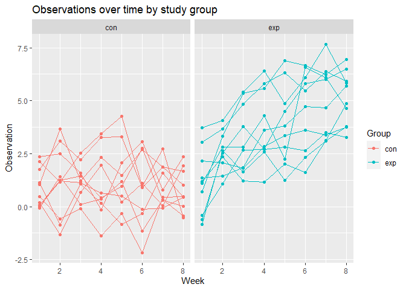
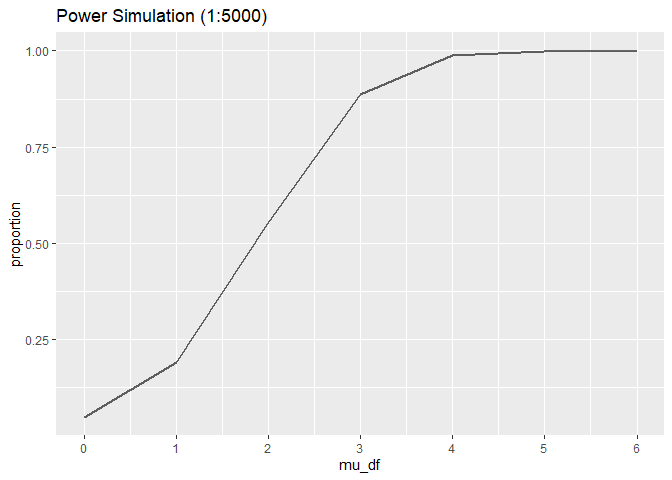
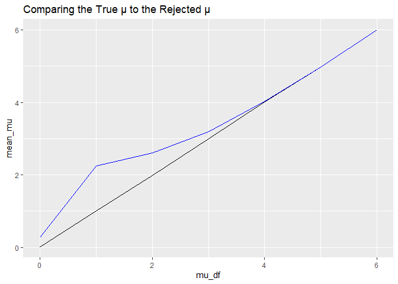

p8105_hw5_ss6692
================
Sanika Sule
2023-11-15

``` r
library(tidyverse)
```

    ## Warning: package 'readr' was built under R version 4.3.2

``` r
library(ggplot2)
library (broom)
library(rvest)
```

### Problem 2

##### Merging .csv files

``` r
con_files = list.files(path = "data/con_data/", pattern = ".csv" )
  con_files = str_c("data/con_data/", con_files)
con_df = map_df(.x = con_files, .f=read_csv, .id = "patient_id")|>
  mutate(arm = "con")
```

    ## Rows: 1 Columns: 8
    ## ── Column specification ────────────────────────────────────────────────────────
    ## Delimiter: ","
    ## dbl (8): week_1, week_2, week_3, week_4, week_5, week_6, week_7, week_8
    ## 
    ## ℹ Use `spec()` to retrieve the full column specification for this data.
    ## ℹ Specify the column types or set `show_col_types = FALSE` to quiet this message.
    ## Rows: 1 Columns: 8
    ## ── Column specification ────────────────────────────────────────────────────────
    ## Delimiter: ","
    ## dbl (8): week_1, week_2, week_3, week_4, week_5, week_6, week_7, week_8
    ## 
    ## ℹ Use `spec()` to retrieve the full column specification for this data.
    ## ℹ Specify the column types or set `show_col_types = FALSE` to quiet this message.
    ## Rows: 1 Columns: 8
    ## ── Column specification ────────────────────────────────────────────────────────
    ## Delimiter: ","
    ## dbl (8): week_1, week_2, week_3, week_4, week_5, week_6, week_7, week_8
    ## 
    ## ℹ Use `spec()` to retrieve the full column specification for this data.
    ## ℹ Specify the column types or set `show_col_types = FALSE` to quiet this message.
    ## Rows: 1 Columns: 8
    ## ── Column specification ────────────────────────────────────────────────────────
    ## Delimiter: ","
    ## dbl (8): week_1, week_2, week_3, week_4, week_5, week_6, week_7, week_8
    ## 
    ## ℹ Use `spec()` to retrieve the full column specification for this data.
    ## ℹ Specify the column types or set `show_col_types = FALSE` to quiet this message.
    ## Rows: 1 Columns: 8
    ## ── Column specification ────────────────────────────────────────────────────────
    ## Delimiter: ","
    ## dbl (8): week_1, week_2, week_3, week_4, week_5, week_6, week_7, week_8
    ## 
    ## ℹ Use `spec()` to retrieve the full column specification for this data.
    ## ℹ Specify the column types or set `show_col_types = FALSE` to quiet this message.
    ## Rows: 1 Columns: 8
    ## ── Column specification ────────────────────────────────────────────────────────
    ## Delimiter: ","
    ## dbl (8): week_1, week_2, week_3, week_4, week_5, week_6, week_7, week_8
    ## 
    ## ℹ Use `spec()` to retrieve the full column specification for this data.
    ## ℹ Specify the column types or set `show_col_types = FALSE` to quiet this message.
    ## Rows: 1 Columns: 8
    ## ── Column specification ────────────────────────────────────────────────────────
    ## Delimiter: ","
    ## dbl (8): week_1, week_2, week_3, week_4, week_5, week_6, week_7, week_8
    ## 
    ## ℹ Use `spec()` to retrieve the full column specification for this data.
    ## ℹ Specify the column types or set `show_col_types = FALSE` to quiet this message.
    ## Rows: 1 Columns: 8
    ## ── Column specification ────────────────────────────────────────────────────────
    ## Delimiter: ","
    ## dbl (8): week_1, week_2, week_3, week_4, week_5, week_6, week_7, week_8
    ## 
    ## ℹ Use `spec()` to retrieve the full column specification for this data.
    ## ℹ Specify the column types or set `show_col_types = FALSE` to quiet this message.
    ## Rows: 1 Columns: 8
    ## ── Column specification ────────────────────────────────────────────────────────
    ## Delimiter: ","
    ## dbl (8): week_1, week_2, week_3, week_4, week_5, week_6, week_7, week_8
    ## 
    ## ℹ Use `spec()` to retrieve the full column specification for this data.
    ## ℹ Specify the column types or set `show_col_types = FALSE` to quiet this message.
    ## Rows: 1 Columns: 8
    ## ── Column specification ────────────────────────────────────────────────────────
    ## Delimiter: ","
    ## dbl (8): week_1, week_2, week_3, week_4, week_5, week_6, week_7, week_8
    ## 
    ## ℹ Use `spec()` to retrieve the full column specification for this data.
    ## ℹ Specify the column types or set `show_col_types = FALSE` to quiet this message.

``` r
exp_files = list.files(path = "data/exp_data/", pattern = ".csv" )
  exp_files = str_c("data/exp_data/", exp_files)
exp_df = map_df(.x = exp_files, .f=read_csv, .id = "patient_id")|>
  mutate(arm = "exp")
```

    ## Rows: 1 Columns: 8
    ## ── Column specification ────────────────────────────────────────────────────────
    ## Delimiter: ","
    ## dbl (8): week_1, week_2, week_3, week_4, week_5, week_6, week_7, week_8
    ## 
    ## ℹ Use `spec()` to retrieve the full column specification for this data.
    ## ℹ Specify the column types or set `show_col_types = FALSE` to quiet this message.
    ## Rows: 1 Columns: 8
    ## ── Column specification ────────────────────────────────────────────────────────
    ## Delimiter: ","
    ## dbl (8): week_1, week_2, week_3, week_4, week_5, week_6, week_7, week_8
    ## 
    ## ℹ Use `spec()` to retrieve the full column specification for this data.
    ## ℹ Specify the column types or set `show_col_types = FALSE` to quiet this message.
    ## Rows: 1 Columns: 8
    ## ── Column specification ────────────────────────────────────────────────────────
    ## Delimiter: ","
    ## dbl (8): week_1, week_2, week_3, week_4, week_5, week_6, week_7, week_8
    ## 
    ## ℹ Use `spec()` to retrieve the full column specification for this data.
    ## ℹ Specify the column types or set `show_col_types = FALSE` to quiet this message.
    ## Rows: 1 Columns: 8
    ## ── Column specification ────────────────────────────────────────────────────────
    ## Delimiter: ","
    ## dbl (8): week_1, week_2, week_3, week_4, week_5, week_6, week_7, week_8
    ## 
    ## ℹ Use `spec()` to retrieve the full column specification for this data.
    ## ℹ Specify the column types or set `show_col_types = FALSE` to quiet this message.
    ## Rows: 1 Columns: 8
    ## ── Column specification ────────────────────────────────────────────────────────
    ## Delimiter: ","
    ## dbl (8): week_1, week_2, week_3, week_4, week_5, week_6, week_7, week_8
    ## 
    ## ℹ Use `spec()` to retrieve the full column specification for this data.
    ## ℹ Specify the column types or set `show_col_types = FALSE` to quiet this message.
    ## Rows: 1 Columns: 8
    ## ── Column specification ────────────────────────────────────────────────────────
    ## Delimiter: ","
    ## dbl (8): week_1, week_2, week_3, week_4, week_5, week_6, week_7, week_8
    ## 
    ## ℹ Use `spec()` to retrieve the full column specification for this data.
    ## ℹ Specify the column types or set `show_col_types = FALSE` to quiet this message.
    ## Rows: 1 Columns: 8
    ## ── Column specification ────────────────────────────────────────────────────────
    ## Delimiter: ","
    ## dbl (8): week_1, week_2, week_3, week_4, week_5, week_6, week_7, week_8
    ## 
    ## ℹ Use `spec()` to retrieve the full column specification for this data.
    ## ℹ Specify the column types or set `show_col_types = FALSE` to quiet this message.
    ## Rows: 1 Columns: 8
    ## ── Column specification ────────────────────────────────────────────────────────
    ## Delimiter: ","
    ## dbl (8): week_1, week_2, week_3, week_4, week_5, week_6, week_7, week_8
    ## 
    ## ℹ Use `spec()` to retrieve the full column specification for this data.
    ## ℹ Specify the column types or set `show_col_types = FALSE` to quiet this message.
    ## Rows: 1 Columns: 8
    ## ── Column specification ────────────────────────────────────────────────────────
    ## Delimiter: ","
    ## dbl (8): week_1, week_2, week_3, week_4, week_5, week_6, week_7, week_8
    ## 
    ## ℹ Use `spec()` to retrieve the full column specification for this data.
    ## ℹ Specify the column types or set `show_col_types = FALSE` to quiet this message.
    ## Rows: 1 Columns: 8
    ## ── Column specification ────────────────────────────────────────────────────────
    ## Delimiter: ","
    ## dbl (8): week_1, week_2, week_3, week_4, week_5, week_6, week_7, week_8
    ## 
    ## ℹ Use `spec()` to retrieve the full column specification for this data.
    ## ℹ Specify the column types or set `show_col_types = FALSE` to quiet this message.

``` r
merged_df = bind_rows(con_df, exp_df) |>
  pivot_longer(cols = starts_with("week"), names_to = "week", values_to = "observation") |>
  mutate(
    week = as.numeric(str_extract(week, "\\d+"))
  )
```

##### Creating a spaghetti plot

``` r
merged_df |>
  ggplot(aes(x=week, y=observation, group = patient_id, color = arm)) +
  facet_grid(~arm) +
  geom_point() +
  geom_line() +
  labs(title = "Observations over time by study group", 
        x = "Week",
        y = "Observation",
        color = "Group")
```

<!-- --> As
shown by the plot, the the experimental group experienced greater
overall changes over time. In general, the observations have a positive
change from week 1 to week nice. The control group had less variation in
observations and the observations remained relatively stable over the 9
weeks. \### Problem 3 \#### Setting up design elements \##### First, we
will calculate p values and mu hat using the provided specifications.
This will be iterated 5000 times.

``` r
sim_power = function(mu) {
  
  data = tibble(
    x = rnorm(n = 30, mean = mu, sd = 5)
  )
  
  output = data |> 
    t.test() |> 
    broom::tidy() |> 
    select(estimate, p.value) |> 
    rename(mu_hat = estimate, p_val = p.value)
}

sim_power_results = expand_grid(
  mu_df = c(0, 1, 2, 3, 4, 5, 6), 
  iteration = 1:5000
) |> 
  mutate(
    estimate = map(mu_df, sim_power)
  ) |> 
  unnest(estimate)
```

##### Now, we will plot the power of the test by the true mu.

``` r
sim_power_results |> 
  group_by(mu_df) |> 
  summarize(
    reject = sum(p_val < 0.05), 
    proportion = reject / 5000) |> 
  ggplot(aes(x = mu_df, y = proportion)) +
  geom_line(alpha = 0.6, linewidth = 0.9) +
  scale_x_continuous(breaks = seq(0,6, 1)) +
  labs(title = "Power Simulation (1:5000)")
```

<!-- -->
Power increases as effect size increases.

##### Now, we will calculate the true mu

``` r
true_mu =
  sim_power_results |> 
  group_by(mu_df) |> 
  summarize(mean_mu = mean(mu_hat))
```

##### Now, we will calculate the average estimate of mu in samples where the null was rejected

``` r
reject_mu = 
  sim_power_results |> 
  filter(p_val < 0.05) |> 
  group_by(mu_df) |> 
  summarize(mean_mu = mean(mu_hat))
```

##### Now, we plot the rejected mu over the true mu to compare.

``` r
ggplot(true_mu, aes(x = mu_df, y = mean_mu)) +
  geom_line() +
  geom_line(data = reject_mu, color = "blue") +
  labs(title = "Comparing the True μ to the Rejected μ")
```

<!-- -->

As the plot shows, the rejected mu reflects the true mu at around 4.
This is likely because as effect size increases, the rejected mu is more
representative of the true mu.
